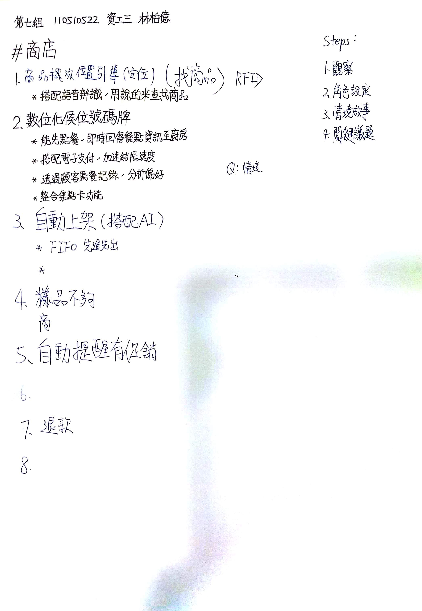

# 期末報告
* 每組報告 12 分鐘
* 我們是第三組
* 下禮拜 `1~6` 組報告；下下禮拜 `7~13` 組報告
* 
* 

# 主題：暫定商品位置導覽機器人
## 1. SET 分析
### 社會面
* 動線順暢
* 新奇吸引消費者(?)
* 國際化：支援多國語言

### 經濟面
* 刺激買氣
* 廣告置入
* 減少人力成本

### 技術面
* 人工智慧(?)
* 大數據：分析消費者產品偏好
* 網路發展

## 2. 角色界定
* 性別
* 年齡
* 個性
    * 耐心
    * 好奇心
* 購物習慣
* 學習能力
* 喜好
* 收入
* 工作

## 3. 故事

## 4. 關鍵議題

## 5. 用途理論
* 想達到甚麼進步?
* 困擾發生在甚麼情境?
* 進步的阻礙是甚麼?
* 如何定義好的『品質』?消費者願意做哪些『取捨』來換取更好的品質?

---

# 商品位置導覽機
## SET分析：
### 社會面
* 動線順暢
* 新奇吸引消費者
* 國際化：支援多國語言
### 經濟面
* 刺激買氣
* 廣告置入
* 減少人力成本
### 技術面
* 語音辨識
* 語音合成技術：產生自然的語音
* 大數據：分析消費者產品偏好
* 網路發展：

## 角色界定：
一名中年男子王先生，大約47歲，育有兩子，是一名工地的老闆，收入相當優渥。
在職場上，大家都稱他為魔鬼老闆，雖然他做事認真為人正直，但他的情緒控管相當的差，只要其中一有人出個小差錯，他就會把那個人罵得狗血淋頭，有不少年輕都因為它而稱不下去，而且還相當小氣，出去吃飯，他每次要請客還規定著裡面的人，不能點超過多少錢，這對於其他人就可以說是相當不滿了。

但是他對待他的家人，彷彿像換了一個人一樣，只要他家人說什麼他就做什麼，完全沒有在工地那般威攝力，及時他的兒女對他無理取鬧，他也不會露出絲毫不悅，可說是一個完美父親。而在週末空閒時，王先生都會帶全家到戶外走走，除了紓解平常的壓力外，也會順便到附近的賣場去採購日常用品，但對於年近半百的他，

## 故事：
大約是在9月的某一天，王先生一家決定在中秋節那天烤肉，於是他們在中秋節的前幾天到了家樂福準備進行採買，一到家樂福了王先生臉色瞬間有些不悅，在商場裡面人滿為患，走路摩肩接踵，寸步難行，但是為了烤肉，他也不得不忍受這個人潮，先是到生鮮食品，他先是想挑肉，但是找來找去就是找不到他想要的牛肉，於是他去找了客服人員幫忙，但是由於今天是中秋節服務人員也是相當忙碌，於是客服人員叫他先使用旁邊的自動尋物機器人，他很快地就來到尋物機器人前，看了一下使用說明，他的小孩先說話了，小朋友的好奇心始終是擋不住的，小孩先是在上面隨意地按按鈕，操弄著螢幕，很快地他說他會用了，這時王先生還是一頭霧水，心裡還生著悶氣，心想著直接跟我講在哪裡不就好了嗎，他的兒子此時已經找到商品在哪了，螢幕上面出現了QR code，這時小孩拿了他的手機掃了一下，手機上面出現地圖，也有一個彷彿是Google小姐的聲音導航著位子，他們跟著導航的位子，很快地就到了牛肉區，買完牛肉之後，他們要去買些新鮮蔬菜，這時小孩就說我來幫忙找吧，他很快地操弄著自己的手機，王先生問不是要去那個機器人才能找嗎，小孩解釋道只要掃完一次 QR code就可以用手機進行查詢了，很方便，王先生雖然覺得很厲害，但是他還是不太想學習這種東西，他心裡的固只想著直接問就好了阿。很快他們就把商品全部買完，結帳回家了。

## 關鍵議題：
1.	老年人接受度低
2.	使用者介面要簡易明瞭，最好能加入多國語言
3.	使用說明要更清楚
4.	導航位置要清楚
5.	機器擺設的位置要顯眼
6.	機器的分佈要均勻，盡可能每個區域都作設置
7.	機器的建置應採取月繳或年繳，避免因高額的售價嚇跑商家
8.	保養與維護成本不可太高，否則商家會排斥採用這套系統
9.	查詢商品的速度要快
10.	會取代一部分的服務人員

## 用途理論：
1. 想達到什麼進步?
    * 減少服務人員的忙碌
    * 減少使用者找尋商品的時間以及焦慮
    * 追蹤且分析使用者的偏好，提升買氣
2. 困擾發生在什麼情境?
    * 客人趕時間的時候
    * 當客人找不到商品時，感到苦惱以及焦慮的時候。
    * 外國人尋找商品時
    * 工作人員忙碌中，無法即時協助消費者時
3. 進步的阻礙是什麼?
    * 有些使用者不喜歡這種冰冷的機器，還是習慣於與人交談
    * 機器的高成本造成普及率低，導致進入一個惡性循環（賣不好→無法大量製造壓低成本→商家更不願採用）
    * 針對觀念保守或已經習慣以往購買模式的人，可能會排斥這套系統
4. 如何定義好的品質?消費者願意做出哪些取捨來換取更好的品質?
    * 反應靈敏、導引正確率高、穩定、語音回覆自然、易於使用
    * 取捨
    * 第一次的高學習成本
    * 減少人與人之間的互動
5. 推知潛藏的社會面的用途
    * 降低找貨時所花費的時間成本
6. 推知潛藏的情感面的用途
    * 減少消費者不安的情緒
7. 推知潛藏的功能面的用途
    * 更快且精準地找到商品
